# **_Configuring Azure ADLSv2 with Qlik Data Integration Suite_**

## **Partner Engineering**

John Park\ Principal Solution Architect\ john.park@qlikcom

**Version: 1.0**

**Revisions**      | **Notes**   | **Date**
------------------ | ----------- | ---------
Initial Draft      | 20-Feb-20   | John Park |
Review of Language | 20-Feb-20   | John Park |
Final Edit for V1  | 21-Feb-20   | John Park |
Edits for Markdown | 25- Feb -20 | John Park |

# Table of Contents

[Summary](#summary)

[Configuring Azure Components](#configuring-azure-components)

[Part 1 - Create or Configure Azure Data Lake Storage (ADLS) Gen2](#part-1---create-or-configure-azure-data-lake-storage-adls-gen2)

[Part 2 - Create an Active Directory "App Registration"**](#part-2---create-an-active-directory-and-perform-app-registration)

[Part 3 - Finalizing Configuration of the ADLS-2 Storage Account](#part-3---finalizing-configuration-of-the-adls-2-storage-account)

[Part 4 - Create a Target Directory in the File System](#part-4---create-a-target-directory-in-the-file-system)

## **Summary**

This document was created to supplement Qlik Replicate and Qlik Compose Documentation. This guide is for customers intending to use Qlik Data Integration suite and Azure ADLSv2 and Azure Databricks. The Official Documentation can be found at

- <https://help.qlik.com/en-US/compose/Content/Compose/Home.htm>

- <https://help.qlik.com/en-US/replicate/Content/Replicate/Home.htm>

Azure ADLSv2 is foundation piece of Azure Technology and is the Object Store underpinning Azure Data Lake service.

Please see Official Documentation about ADLSv2 here:

- <https://docs.microsoft.com/en-us/azure/storage/blobs/data-lake-storage-introduction>

## **Configuring Azure Components**

**High Level Overview**

- **Create or Configure Azure Data Lake Storage (ADLS) Gen2**

- **Create Azure Active Directory Application**

- **Create ADLS File System and Folder**

### **Part 1 - Create or Configure Azure Data Lake Storage (ADLS) Gen2**

First, we need to set up the Azure storage account that Qlik Replicate will use to map data into Azure Databricks. We will setup Azure Data Lake Storage (ADLSv2) to manage the external tables.

If you do not already have an ADLSv2 storage account, we need to create one now. From your Azure portal home page, click on Storage Accounts.

**_Figure A.1.0._**

{width="6.8079932195975505in" height="2.240964566929134in"}

Inside Storage Accounts click "+ Add".\ **_Figure A.1.1_**

{width="6.5in" height="1.4375in"}

Select your azure subscription and an existing resource group or select _"_Add" to create a new storage account one. Next choose a name for your storage account and a location. For Account kind be sure that it says StorageV2 (general purpose v2).

*Refer to your IT Policies for Subscriptions and Resource Groups

**_Figure A.1.2_**

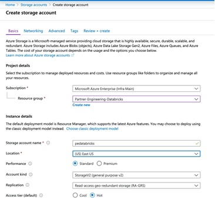

Click "Next: Networking" at the bottom of the page. Make note of the name of the "Storage account name" on this page.

For this setup we want to make Storage open to public, but you can change the setup to fit your organization needs. If Storage Account Network is configured Private endpoints with Private virtual networks, make sure to add 2 subnets that Azure Databricks creates so Storage Account is accessible to Azure Databricks. _Upon launching Azure Databricks, the service will create "Databricks-Private" and "Databricks-Public" subnets._

**_Figure A.1.3_**

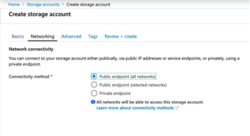

Click "Next: Advanced" at the bottom of the page. On the Advanced tab, we want to be sure that Data Lake Storage Gen2 "Hierarchical namespace" is enabled.

**_Figure A.1.4._**

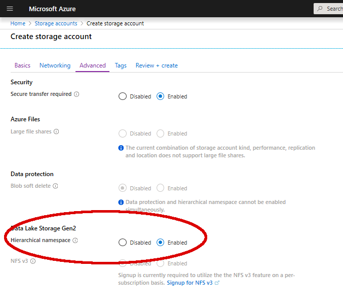{width="2.875in" height="2.5625in"}

Configuration is complete. Press Review + create at the bottom of the page. Azure will validate what you have configured.

**_Figure A.1.5._**

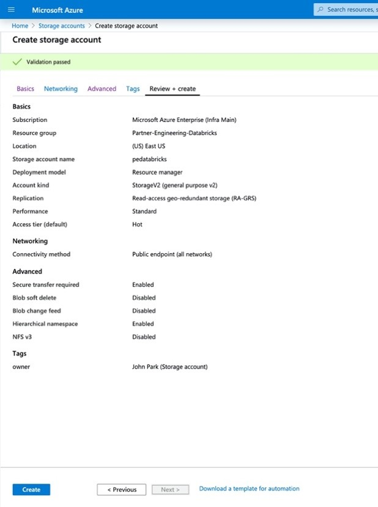

Assuming your configuration passed the validation step, press "Create" button at the bottom of the page. It will take Azure a few minutes to create your storage account.

### **Part 2 - Create an Active Directory and perform "App Registration"**

Now we need to create an Azure "App Registration" with appropriate permissions that Qlik Replicate will use when writing data to ADLSv2 storage. From the Azure portal home page, click on "Azure Active Directory".

**_Figure A.2.0._**

Click on "App registrations" on the left side of the screen.

**_Figure A.2.1._**

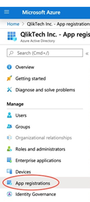

Select "App registrations" from side menu and click "_+ New registration"._

**_Figure A.2.2_**

Choose a name for your App and press "Register" at the bottom of the page. You do not need to enter anything for the "Redirect URI". It is optional and not required in our case.

**_Figure A.2.3_**

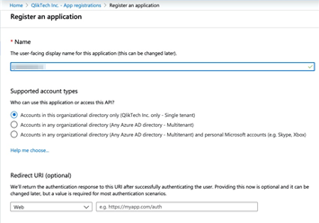

Registration is almost immediate. Make note of the location of the "Application (client) ID" and "Directory (tenant) ID" fields at the top of the page. You will need this information later when configuring Replicate.

**_Figure A.2.4_** 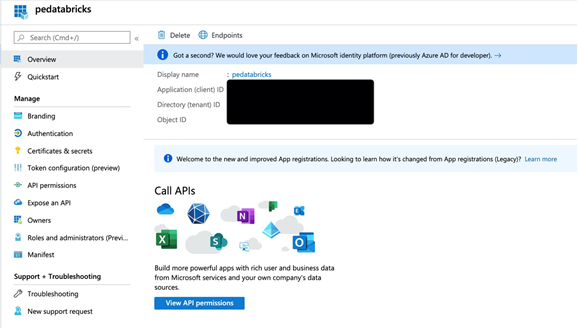

Next, we need to grant this application some basic permissions. Click on _API permissions_ on the left side of the page.

**_Figure A.2.5_** 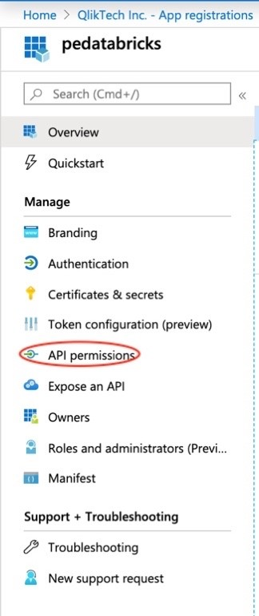 Click "_+ Add permission"_ followed by _Azure Data Lake_ under "Microsoft APIs" on the right side of the screen.

**_Figure A.2.6_** 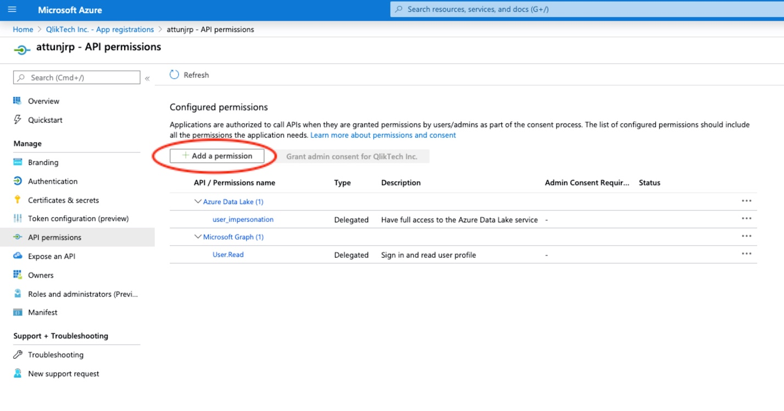

**_Figure A.2.7_** 
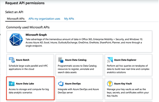

From there, check "user_impersonation" under "Delegated permissions" and then press "Add permissions" button at the bottom of the page

**_Figure A.2.8_**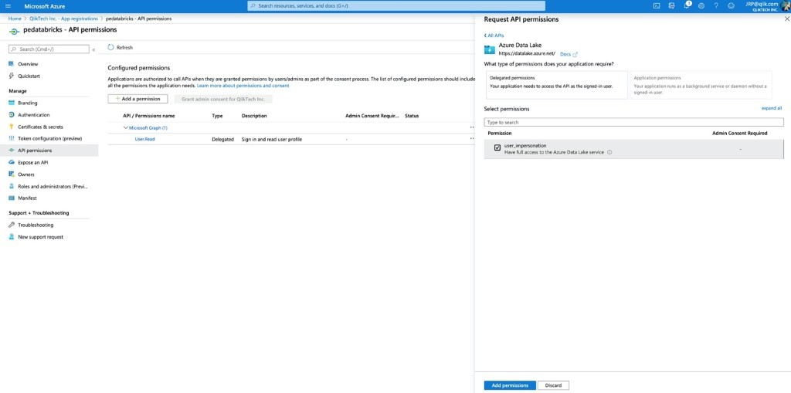 Now we need to create a "secret" (essentially a password) for this API. Click on "Certificates & secrets" on the left side of the screen and click on "+ New client secret".**_Figure A.2.9_** 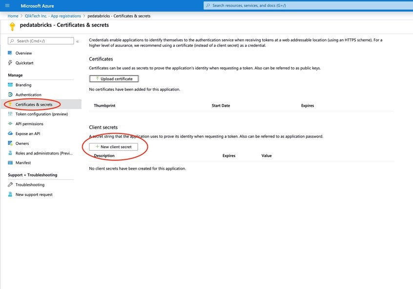{width="4.246988188976378in" height="2.089012467191601in"}

Enter a description, choose an expiration, and press "_Add."_

**_Figure A.2.10_**

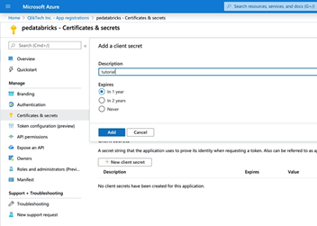{width="3.6666666666666665in" height="2.6145833333333335in"}

**IMPORTANT NOTE**: Make Note of value of "Secret" you generated. You must save the value of the secret you created before you leave this page. You will not be able to retrieve it again later.

**_Figure A.2.11_**

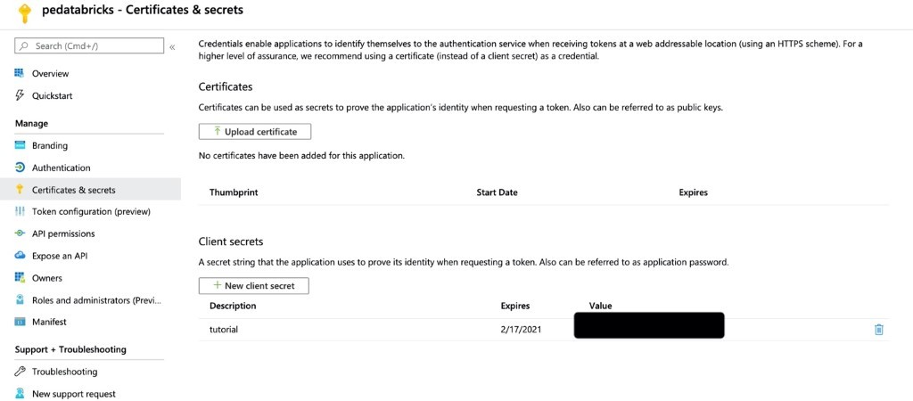{width="6.5in" height="2.8541666666666665in"}

### **Part 3 - Finalizing Configuration of the ADLS-2 Storage Account**

Now that we have created the Azure Active Directory App Registration, we need to return to the ADLS-2 storage account and finalize the configuration, so it is ready for use by Qlik Replicate. Return to the Azure Portal home page and then drill in to get back to the storage account we created. (Refer to Figure A1.3)

First, we need to create a "Container" for us to use for the Qlik Replicate. Select "Containers" on the left side of the storage account screen.

**_Figure A.3.1_**

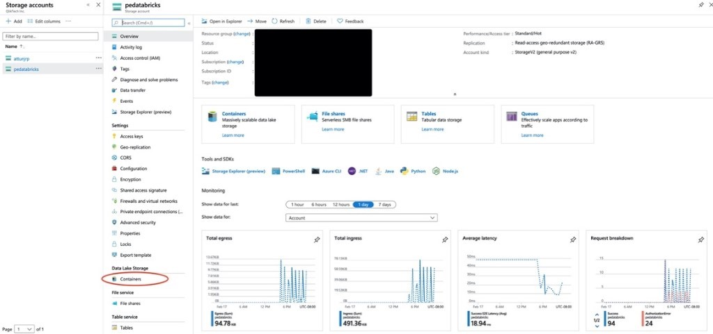{width="5.25in" height="2.4583333333333335in"}

Inside your Storage account "+ Container" at the top of the page.

**_Figure A.3.2_**

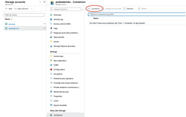{width="5.201115485564304in" height="3.267716535433071in"}

Enter a name for the Container and press "OK" to save it.

**_Figure A.3.3_**

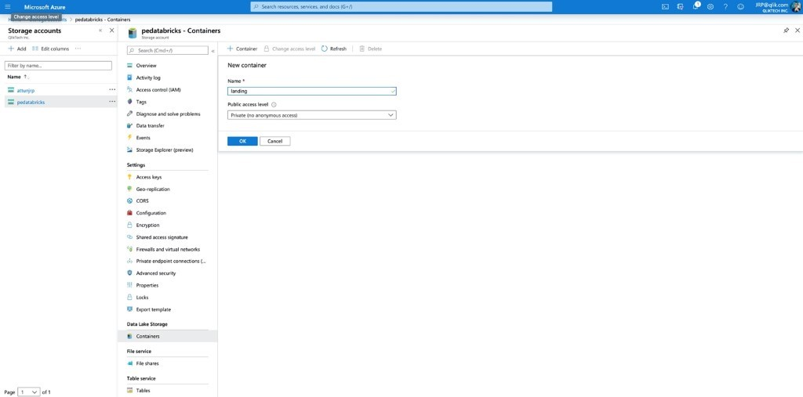{width="6.5in" height="3.21875in"}

As a final step, we need to grant access to the storage account to the "App" that we created / registered previously. Click on "Access control (IAM)" on the left side of the page.

**_Figure A.3.4_**

{width="6.5in" height="2.0208333333333335in"}

Click on "Add a role assignment" on right.

Once in the Screen on the right side of the screen select:

- _Role**_:** Storage Blob Data Contributor

- _Assign access to_: `Azure AD user, group, or service principal

- _Select_: enter the name of the App you registered previously. (**_Figure A.2.4_**)

and press "Save" button at the bottom of the page.

**_Figure A.3.5_**

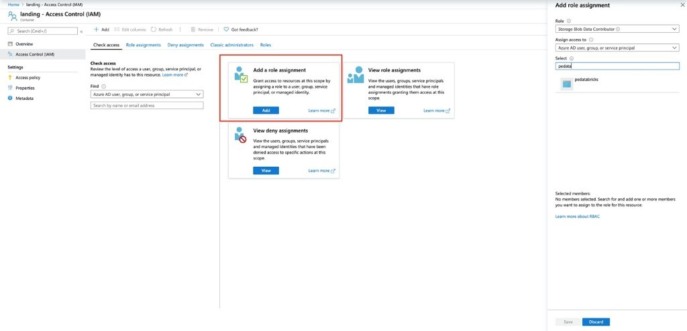{width="6.5in" height="3.1354166666666665in"}

### **Part 4 - Create a Target Directory in the File System**

To complete this part of the guide, you will need to create a target directory where Qlik Replicate will deliver data for the Databricks external tables.

To get started, go to your ADLS-2 storage account and click on Storage Explorer (preview). This will download Storage Explorer application on your computer. Select Storage Accounts and select Blob Container created

**_Figure A.4.1_**

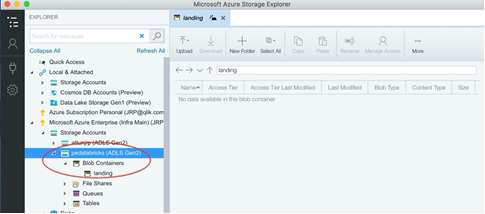{width="5.052084426946632in" height="2.2291666666666665in"}

From there click on Blob Container Created and Add New Folders for Qlik Replicate (In this example we used "test" as folder name)

**_Figure A.4.2_**

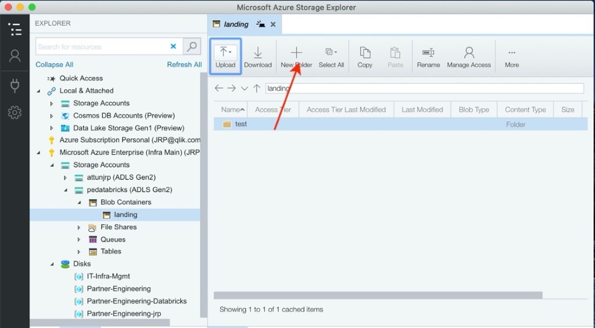{width="5.04166447944007in" height="2.78125in"}

In the next section we will configure Azure Databricks to make use of this storage and make it ready to ingest data delivered by Qlik Replicate.
