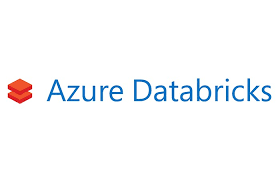

# **_Configuring Qlik Replicate with Azure Databricks_**

## **Partner Engineering**

<br>
<br>
<br>
<br>

John Park<br>
Principal Solution Architect<br>
john.park@qlik.com

**Version: 1.1**<br>
**Initial Release Date: 17-Feb-20**<br><br><br><br>



**Revisions**      | **Notes**   | **Date**  | **Version**
------------------ | ----------- | --------- | -----------
Initial Draft      | 03-Jan-2020 | John Park | 0.1         |
Additional Changes | 14-Feb-2020 | John Park | 0.2         |
Remove ADLS Config | 18-Feb-2020 | John Park | 0.3         |
Final Edit for V1  | 21-Feb-2020 | John Park | 0.4         |
Cosmetic Changes   | 21-Feb-2020 | John Park | 1.0         |
Edits for Markdown | 25-Feb-2020 | John Park | 1.1         |

--------------------------------------------------------------------------------

# Table of Contents

[Summary](#summary)

[Section A - Configuring Azure Databricks Components](#section-a---configuring-azure-databricks-components)

[Part 1 - Download and Install Databricks ODBC Driver](#part-1---download-and-install-databricks-odbc-driver)

[Part 2 - Create Databricks Token and Edit Spark Configuration](#part-2---create-databricks-token-and-edit-spark-configuration)

[Part 3 - Execute Code to Mount Data Drive](#part-3---execute-code-to-mount-data-drive)

[Part 4 - Create Databricks DB and Collect ODBC Settings](#part-4---create-databricks-db-and-collect-odbc-settings)

[Section B - Configuring Azure Databricks connection on Qlik Replicate](#section-b---configuring-azure-databricks-components)

[Part 1 - Create Microsoft Azure Databricks Endpoint Connection](#part-1---create-microsoft-azure-databricks-endpoint-connection)

[Part 2 - Azure Storage Configuration](#part-2---azure-storage-configurationto-optimize-delivery-into-the-databricks-environment-replicate-delivers-change-data-in-a-continual-series-of-micro-batches-that-are-staged-for-bulk-ingest.-you-can-configure-the-databricks-on-azure-endpoint-to-stage-the-data-files-on-databricks-i.e.-internally-or-on-amazon-s3.)

[Part 3 - Databricks ODBC Access Configuration](#part-3---databricks-odbc-access-configuration)

[Part 4 - Test and Save](#part-4---test-and-save)

## **Summary**

This document was created to supplement Qlik Replicate Documentation for customers intending to Qlik Replicate and Azure Databricks. The Office Documentation can be found at <https://help.qlik.com/en-US/replicate/Content/Replicate/Home.htm>.

## **Section A - Configuring Azure Databricks Components**

> **High Level Overview**

- **Download and Install Databricks ODBC Driver**

- **Create Databricks Token and Edit Spark Configuration**

- **Execute Code to Mount Data Drive**

- **Create Databricks DB and Collect ODBC Settings**

At this point Azure Data Lake Storage account and Active Directory settings we need should be configured, we need to configure Azure Databricks so that it can make use of that storage. We also need to do a configure few things to prepare Azure Databricks to accept data loaded by Qlik Replicate. _Please refer to "Configuring Azure ADLSv2 for Qlik Data Integration" guide for ADLSv2 Instructions._

Everything we do in this section of the setup will be done from your Databricks workspace, so go ahead and log in to Databricks from Azure Portal.

**_Figure A.0.1_** 

### **Part 1 - Download and Install Databricks ODBC Driver**

Please refer to Databricks Documentation and setup ODBC Driver for Windows/Linux Server Qlik Replicate is running on.

<https://docs.databricks.com/bi/jdbc-odbc-bi.html#connect-bi-tools>

### **Part 2 - Create Databricks Token and Edit Spark Configuration**

### Replicate uses a Databricks "access token" to access Databricks. The first thing we will do is create one. This is done from the "User Settings" drop down of the workspace.

**_Figure A.2.0_**


From "User Settings" select the "Access Tokens" tab and then Press "Generate New Token".

**_Figure A.2.1_**


Enter a comment and select "Generate".

**_Figure A.2.2_**


Please make sure to copy the Token value and save the generated token off now. You will not be able to retrieve it later.

**_Figure A.2.3_**


**_Figure A.2.4_**

<br>
Edit the Spark Configuration

First select the cluster we will be using for this test drive by clicking on "Cluster" Icon on left side of screen.

**_Figure A.2.5_**


We need to make a change, so select "Edit" button.

**_Figure A.2.6_**


Now scroll down,

- Select > "Advanced Options"

- Select the "Spark" tab

- Enter the string `"spark.hadoop.hive.server2.enable.doAs false"` in the Spark Config section.

**_Figure A.2.6_**


and then click "Confirm and Restart" button at the top of the page.

### **Part 3 - Execute Code to Mount Data Drive**

The next step is to mount the Azure Data Lake Gen-2 Storage we created previously in Databricks so it can be accessed.

Open a Notebook and execute the following python command:

**_Figure A.3.0_**

```
%python

configs = {\"fs.azure.account.auth.type\": \"OAuth\",

\"fs.azure.account.oauth.provider.type\": \"org.apache.hadoop.fs.azurebfs.oauth2.ClientCredsTokenProvider\",

\"fs.azure.account.oauth2.client.id\": \"\

<application-id\>\",</application-id\>

\"fs.azure.account.oauth2.client.secret\": \"\

<client-secret\>\"),</client-secret\>

\"fs.azure.account.oauth2.client.endpoint\": \"<https://login.microsoftonline.com/\>

<directory-id\>/oauth2/token\"}</directory-id\>

# Optionally, you can add \

<directory-name\> to the source URI of your
mount point.</directory-name\>

dbutils.fs.mount(

source = \"abfss://\

<file-system-name\>@\<storage-account-name\>.dfs.core.windows.net/\<directory-name\>/\",</directory-name\></storage-account-name\></file-system-name\>

mount_point = \"/mnt/\

<mount-name\>\",</mount-name\>

extra_configs = configs)
```

where:

- <application-id\> is the Azure Active Directory Application (client) ID we made note of earlier.(Fig</application-id\>

- <client-secret\> is the Azure Active Directory Application (client) Key we created.</client-secret\>

- <directory-id\> is the Azure Active Directory ID (tenant ID).</directory-id\>

- _source_ is the file system at target folder that will contain the data delivered by replicate.

- <file-system-name\> is the ADLS-2 file system we are using.</file-system-name\>

- <storage-account-name\> is the ADLS-2 storage account we are using.</storage-account-name\>

- <directory-name\> is the name of the directory in the file system we will be writing to.</directory-name\>

- <mount-name\> is where the <em>source</em> is mounted in Databricks. This will be used later by Replicate.</mount-name\>

> ### **_If this fails please check your azure storage account network settings._**

**_Figure B.3.1_**

 _\_

## **Part 4 - Create Databricks DB and Collect ODBC Settings**

Add Additional Cell in the Databricks Notebook by clicking on Down Arrow and selecting "Add Cell Below"

**_Figure B.4.0_**


Execute the following Code:

**_Figure B.4.1_**

\%sql

drop database if exists \

<database-name\>;</database-name\>

create database \

<database-name\> location \'\<mount-point\>\';</mount-point\></database-name\>

where:

- \

  <database-name\> is the name of the database you want to create;
  and</database-name\>

- \

  <mount-point\> is the mount point you created above.</mount-point\>

The results should look something like this:

**_Figure B.4.2_**


--------------------------------------------------------------------------------

### **Collect ODBC Connection Info**

Replicate uses ODBC to write table metadata to Databricks. We need to collect some information from Databricks that we will need in the next section of the guide.

Once again, select the cluster you are using and go to "> Advanced Options". From there, select the "JDBC/ODBC" tab.

**_Figure B.4.3_**


You should make note of the "Server Hostname", "Port" (normally 443), and "HTTP Path".

Now you should have all information for configuring the Qlik Replicate Azure Databricks target endpoint!

## **Section B - Configure Azure Databricks connection on Qlik Replicate**

First things first, we need to do is open Qlik Replicate. Click the Qlik Replicate icon to open Replicate in a new tab in your browser.

Once you are logged in you will see the main screen for Qlik Replicate.

**_Figure C.1.0_**


### **Part 1 - Create Microsoft Azure Databricks Endpoint Connection**

The first thing we need to do is create a target endpoint. We do this by clicking the "Manage Endpoint Connections" button at the top of the screen.

**_Figure C.1.1_**


**_Figure C.1.2_**


From there, click on "Add New Endpoint Connection" link or the + "New Endpoint Connection" button at the top of the screen.

Once you do that you will see this window:

**_Figure C.1.3_**


We will now create a Databricks Target endpoint:

- Replace the text "**New Endpoint Connection 1"** with something more descriptive like Databricks-Target, make sure the **Target** radio button is selected.

- Select "Microsoft Azure Databricks" from the dropdown selection box.

**_Figure C.1.4_**


Replicate creates external tables in the Databricks metadata store using ODBC, and when running Full Load and Store Changes tasks, it writes the files to Azure storage. Similar to other endpoints, Replicate creates change data partitions in the Partition Control Table and in the metadata store.

### **Part 2 - Azure Storage Configuration**To optimize delivery into the Databricks environment, Replicate delivers change data in a continual series of micro batches that are staged for bulk ingest. You can configure the Databricks on Azure endpoint to stage the data files on Databricks (i.e. internally) or on Amazon S3.

Replicate supports delivering the data for the external tables into Azure Blob Storage as well as into Azure Data Lake Storage (ADLS) Gen2\. In either case, the storage location must be accessible from the Replicate server, and obviously must have write access as well. Further, in order for Databricks to be able to access the data, the storage that Replicate writes to needs to be mounted on the Databricks File System (DBFS).

**_Figure C.1.5_**


_Please note Replicate only supports writing data to Blob Storage when Replicate is running on a Windows Server_.

**_Figure C.1.6_**


Fill in the blanks related to ADLS Gen2 storage with information specific to your Azure subscription. We worked through how to configure and obtain this information in the previous 'Configure Azure Data Lake Gen2 Storage' section.

- **Storage account**: specify the name of your ADLS Gen2 storage account (Please refer to Figure A.1.3).

- **Azure Active Directory ID**: specify your Azure Active Directory (tenant) ID (Please refer to Figure A.2.4).

- **Azure Active Directory application ID**: specify the Azure Active Directory application (client) ID (Please refer to Figure A.2.4).

- **Azure Active Directory application key**: specify the Azure Active Directory application (client) key (Please refer to Figure A.2.10).

- **File System**: the ADLS Gen2 file system containing your folders and files (Please refer to Figure A.3.3).

- **Target folder**: the folder where we want Replicate to create the data files on ADLS(Please refer to Figure A.4.3).

> _Note: if you specify a folder that does not exist, Replicate will create it for you. You may also press "_Browse" _to find directories in your file system that you may choose from. If you created a directory as the guide suggested in the 'Configure Azure Data Lake Gen2 Storage' section, you will see that directory listed when you press browse._

**_Figure C.1.7_**


### **Part 3 - Databricks ODBC Access Configuration**

Now click on the arrow (>) next to "Databricks ODBC Access":

**_Figure C.1.7_**


Fill in the blanks with information pertaining to your Databricks subscription. We worked through how to configure and obtain this information in the previous 'Prepare Databricks for Data Delivery' section.

- **Host**: specify the host name of the Databricks workspace where the ADLS storage containers are mounted(Please refer to Figure B.4.3).

- **Port**: specify the port to use to access the workspace (443 by default) (Please refer to Figure B.4.3).

- **Token**: specify the Databricks Token (Please refer to Figure B.2.3).

- **HTTP Path**: specify the path to the cluster being used (Please refer to Figure A.4.3).

- **Database**: specify the name of the Databricks target database (Please refer to Figure B.4.2).

> _Note: you can_ Browse _for existing databases if needed._

- **Mount Path**: specify the mount path to the storage tables. This is the mount path we created previously. (Please refer to Figure B.4.2).

> _Note that the mount path cannot contain special characters or spaces._

_\_

### **Part 4 - Test and Save**

Once you have completed configuring the Databricks endpoint, click on "Test Connection". Your connection window should look like the following, indicating that your connection succeeded.

**_Figure C.1.8_**


Assuming so, click "Save" and the configuration of your Databricks on Azure target endpoint is complete. Click "Close" to close the window.

For more details about using Databricks as a target, please review the section in our Help Guide.
