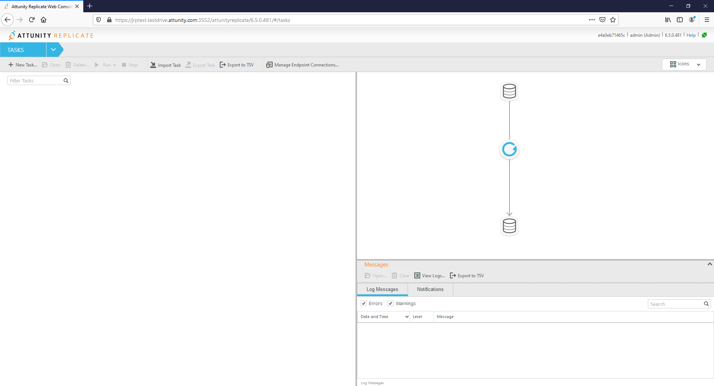

{width="3.2083333333333335in"
height="0.9791666666666666in"}

Configuring Qlik Replicate with Azure Databricks

Partner Engineering

**Version: 1.0**

**Initial Release Date: 17-Feb-20**

{width="2.9166666666666665in" height="1.875in"}

  **Revisions**                                                         **Notes**                          **DATE**
  --------------------------------------------------------------------- ---------------------------------- -----------
  John Park/Author/ Principal Solution Architect, Partner Engineering   Initial Draft                      03-Jan-20
  John Park                                                             Additional Changes for Draft 1.0   14-Feb-20
  John Park                                                             Removing Azure ADLS Setup          18-Feb-20
  John Park                                                             Cosmetic Changes                   20-Feb-20
  John Park                                                             Final Review for V1                

Table of Contents {#table-of-contents .TOCHeading}
=================

[Summary 4](#summary)

[Section A - Configuring Azure Databricks Components
5](#section-a---configuring-azure-databricks-components)

[**Part 1 - Download and Install Databricks ODBC Driver**
6](#part-1---download-and-install-databricks-odbc-driver)

[**Part 2 - Create Databricks Token and Edit Spark Configuration**
6](#part-2---create-databricks-token-and-edit-spark-configuration)

[Replicate uses a Databricks "access token" to access Databricks. The
first thing we will do is create one. This is done from the "User
Settings" drop down of the workspace.
6](#replicate-uses-a-databricks-access-token-to-access-databricks.-the-first-thing-we-will-do-is-create-one.-this-is-done-from-the-user-settings-drop-down-of-the-workspace.)

[**Part 3 - Execute Code to Mount Data Drive**
10](#part-3---execute-code-to-mount-data-drive)

[**Part 4 - Create Databricks DB and Collect ODBC Settings**
12](#part-4---create-databricks-db-and-collect-odbc-settings)

[Section C - Configure Azure Databricks connection on Qlik Replicate
15](#section-b---configure-azure-databricks-connection-on-qlik-replicate)

[**Part 1 - Create Microsoft Azure Databricks Endpoint Connection**
16](#part-1---create-microsoft-azure-databricks-endpoint-connection)

[**Part 2 - Azure Storage Configuration**To optimize delivery into the
Databricks environment, Replicate delivers change data in a continual
series of micro batches that are staged for bulk ingest. You can
configure the Databricks on Azure endpoint to stage the data files on
Databricks (i.e. internally) or on Amazon S3.
18](#part-2---azure-storage-configurationto-optimize-delivery-into-the-databricks-environment-replicate-delivers-change-data-in-a-continual-series-of-micro-batches-that-are-staged-for-bulk-ingest.-you-can-configure-the-databricks-on-azure-endpoint-to-stage-the-data-files-on-databricks-i.e.-internally-or-on-amazon-s3.)

[**Part 3 - Databricks ODBC Access Configuration**
21](#part-3---databricks-odbc-access-configuration)

[**Part 4 - Test and Save** 23](#part-4---test-and-save)

 **Summary **
-------------

This document was created to supplement Qlik Replicate Documentation for
customers intending to Qlik Replicate and Azure Databricks. The Office
Documentation can be found at
<https://help.qlik.com/en-US/replicate/Content/Replicate/Home.htm>.

**Section A - Configuring Azure Databricks Components**
-------------------------------------------------------

> **High Level Overview**

-   **Download and Install Databricks ODBC Driver**

-   **Create Databricks Token and Edit Spark Configuration**

-   **Execute Code to Mount Data Drive **

-   **Create Databricks DB and Collect ODBC Settings**

At this point Azure Data Lake Storage account and Active Directory
settings we need should be configured, we need to configure Azure
Databricks so that it can make use of that storage. We also need to do a
configure few things to prepare Azure Databricks to accept data loaded
by Qlik Replicate. *Please refer to "Configuring Azure ADLSv2 for Qlik
Data Integration" guide for ADLSv2 Instructions.*

Everything we do in this section of the setup will be done from your
Databricks workspace, so go ahead and log in to Databricks from Azure
Portal.

***Figure A.0.1***

#### {width="6.5in" height="3.265972222222222in"}

### **Part 1 - Download and Install Databricks ODBC Driver**

Please refer to Databricks Documentation and setup ODBC Driver for
Windows/Linux Server Qlik Replicate is running on.

<https://docs.databricks.com/bi/jdbc-odbc-bi.html#connect-bi-tools>

### **Part 2 - Create Databricks Token and Edit Spark Configuration**

### Replicate uses a Databricks "access token" to access Databricks. The first thing we will do is create one. This is done from the "User Settings" drop down of the workspace.

***Figure A.2.0***

{width="6.5in"
height="2.4in"}

From "User Settings" select the "Access Tokens" tab and then Press
"Generate New Token".

***Figure A.2.1***

{width="6.5in"
height="1.9986111111111111in"}

Enter a comment and select "Generate".

***Figure A.2.2***

{width="6.5in"
height="2.25625in"}

Please make sure to copy the Token value and save the generated token
off now. You will not be able to retrieve it later.

***Figure A.2.3***

{width="6.5in"
height="2.183333333333333in"}

***Figure A.2.4***

{width="6.5in"
height="1.4861111111111112in"}

Edit the Spark Configuration

The *Spark Config* section of you Databricks cluster configuration must
contain the line "spark.hadoop.hive.server2.enable.doAs false" when
using ADLS Gen2 storage.

First select the cluster we will be using for this test drive by
clicking on "Cluster" Icon on left side of screen.

***Figure A.2.5***

{width="6.5in"
height="2.5625in"}

We need to make a change, so select "Edit" button.

***Figure A.2.6***

{width="6.5in"
height="1.6506944444444445in"}

Now scroll down,

-   select \> "Advanced Options"

-   select the "Spark" tab

-   enter the string "spark.hadoop.hive.server2.enable.doAs false" in
    the Spark Config section.

***Figure A.2.6***

{width="5.305984251968504in"
height="5.754385389326334in"}

and then click "Confirm and Restart" button at the top of the page.

### **Part 3 - Execute Code to Mount Data Drive **

The next step is to mount the Azure Data Lake Gen-2 Storage we created
previously in Databricks so it can be accessed.

Open a Notebook and execute the following python command:

***Figure A.3.0***

\%python

configs = {\"fs.azure.account.auth.type\": \"OAuth\",

\"fs.azure.account.oauth.provider.type\":
\"org.apache.hadoop.fs.azurebfs.oauth2.ClientCredsTokenProvider\",

\"fs.azure.account.oauth2.client.id\": \"\<application-id\>\",

\"fs.azure.account.oauth2.client.secret\": \"\<client-secret\>\"),

\"fs.azure.account.oauth2.client.endpoint\":
\"https://login.microsoftonline.com/\<directory-id\>/oauth2/token\"}

\# Optionally, you can add \<directory-name\> to the source URI of your
mount point.

dbutils.fs.mount(

source =
\"abfss://\<file-system-name\>@\<storage-account-name\>.dfs.core.windows.net/\<directory-name\>/\",

mount\_point = \"/mnt/\<mount-name\>\",

extra\_configs = configs)

where:

-   \<application-id\> is the Azure Active Directory Application
    (client) ID we made note of earlier.(Fig

-   \<client-secret\> is the Azure Active Directory Application (client)
    Key we created.

-   \<directory-id\> is the Azure Active Directory ID (tenant ID).

-   *source* is the file system at target folder that will contain the
    data delivered by replicate.

    -   \<file-system-name\> is the ADLS-2 file system we are using.

    -   \<storage-account-name\> is the ADLS-2 storage account we are
        using.

    -   \<directory-name\> is the name of the directory in the file
        system we will be writing to.

-   \<mount-name\> is where the *source* is mounted in Databricks. This
    will be used later by Replicate.

> ***If this fails please check your azure storage account network
> settings.***

***Figure B.3.1***

{width="6.5in"
height="3.127083333333333in"}

*\
*

### **Part 4 - Create Databricks DB and Collect ODBC Settings**

Add Additional Cell in the Databricks Notebook by clicking on Down Arrow
and selecting "Add Cell Below"

***Figure B.4.0***

{width="2.986111111111111in"
height="4.625in"}

Execute the following Code:

***Figure B.4.1***

\%sql

drop database if exists \<database-name\>;

create database \<database-name\> location \'\<mount-point\>\';

where:

-   \<database-name\> is the name of the database you want to create;
    and

-   \<mount-point\> is the mount point you created above.

The results should look something like this:

***Figure B.4.2***

{width="6.5in"
height="1.1590277777777778in"}

***\
***

#### **Collect ODBC Connection Info**

Replicate uses ODBC to write table metadata to Databricks. We need to
collect some information from Databricks that we will need in the next
section of the guide.

Once again, select the cluster you are using and go to "\> Advanced
Options". From there, select the "JDBC/ODBC" tab.

***Figure B.4.3***

{width="4.482456255468066in"
height="3.3000634295713036in"}

You should make note of the "Server Hostname", "Port" (normally 443),
and "HTTP Path".

Now you should have all information for configuring the Qlik Replicate
Azure Databricks target endpoint!

**Section B - Configure Azure Databricks connection on Qlik Replicate**
-----------------------------------------------------------------------

First things first, we need to do is open Qlik Replicate. Click the Qlik
Replicate icon to open Replicate in a new tab in your browser.

Once you are logged in you will see the main screen for Qlik Replicate.

***Figure C.1.0***

{width="5.046242344706911in"
height="2.733380358705162in"}

### **Part 1 - Create Microsoft Azure Databricks Endpoint Connection**

The first thing we need to do is create a target endpoint. We do this by
clicking the "Manage Endpoint Connections" button at the top of the
screen.

***Figure C.1.1***

{width="6.5in"
height="1.8305555555555555in"}

***Figure C.1.2***

{width="3.7109831583552055in"
height="2.7713429571303587in"}

From there, click on "Add New Endpoint Connection" link or the + "New
Endpoint Connection" button at the top of the screen.

Once you do that you will see this window:

***Figure C.1.3***

{width="3.369942038495188in"
height="2.6282666229221348in"}

We will now create a Databricks Target endpoint:

-   Replace the text "**New Endpoint Connection 1"** with something more
    descriptive like Databricks-Target, make sure the** Target **radio
    button is selected.

-   Select "Microsoft Azure Databricks" from the dropdown selection box.

***Figure C.1.4***

{width="3.6679527559055116in"
height="3.011560586176728in"}

Replicate creates external tables in the Databricks metadata store using
ODBC, and when running Full Load and Store Changes tasks, it writes the
files to Azure storage. Similar to other endpoints, Replicate creates
change data partitions in the Partition Control Table and in the
metadata store.

### **Part 2 - Azure Storage Configuration**To optimize delivery into the Databricks environment, Replicate delivers change data in a continual series of micro batches that are staged for bulk ingest. You can configure the Databricks on Azure endpoint to stage the data files on Databricks (i.e. internally) or on Amazon S3.

Replicate supports delivering the data for the external tables into
Azure Blob Storage as well as into Azure Data Lake Storage (ADLS) Gen2.
In either case, the storage location must be accessible from the
Replicate server, and obviously must have write access as well. Further,
in order for Databricks to be able to access the data, the storage that
Replicate writes to needs to be mounted on the Databricks File System
(DBFS).

***Figure C.1.5***

{width="4.942197069116361in"
height="2.280485564304462in"}

*Please note Replicate only supports writing data to Blob Storage when
Replicate is running on a Windows Server*.

***Figure C.1.6***

{width="4.299852362204724in"
height="3.421965223097113in"}

Fill in the blanks related to ADLS Gen2 storage with information
specific to your Azure subscription. We worked through how to configure
and obtain this information in the previous 'Configure Azure Data Lake
Gen2 Storage' section.

-   **Storage account**: specify the name of your ADLS Gen2 storage
    account (Please refer to Figure A.1.3).

-   **Azure Active Directory ID**: specify your Azure Active Directory
    (tenant) ID (Please refer to Figure A.2.4).

-   **Azure Active Directory application ID**: specify the Azure Active
    Directory application (client) ID (Please refer to Figure A.2.4).

-   **Azure Active Directory application key**: specify the Azure Active
    Directory application (client) key (Please refer to Figure A.2.10).

-   **File System**: the ADLS Gen2 file system containing your folders
    and files (Please refer to Figure A.3.3).

-   **Target folder**: the folder where we want Replicate to create the
    data files on ADLS(Please refer to Figure A.4.3).

> *Note: if you specify a folder that does not exist, Replicate will
> create it for you. You may also press "*Browse"* to find directories
> in your file system that you may choose from. If you created a
> directory as the guide suggested in the 'Configure Azure Data Lake
> Gen2 Storage' section, you will see that directory listed when you
> press browse.*

***Figure C.1.7***

{width="4.670599300087489in"
height="3.8208092738407697in"}

### **Part 3 - Databricks ODBC Access Configuration**

Now click on the arrow (\>) next to "Databricks ODBC Access":

***Figure C.1.7***

{width="3.4450863954505686in"
height="2.7461318897637796in"}

Fill in the blanks with information pertaining to your Databricks
subscription. We worked through how to configure and obtain this
information in the previous 'Prepare Databricks for Data Delivery'
section.

-   **Host**: specify the host name of the Databricks workspace where
    the ADLS storage containers are mounted(Please refer to Figure
    B.4.3).

-   **Port**: specify the port to use to access the workspace (443 by
    default) (Please refer to Figure B.4.3).

-   **Token**: specify the Databricks Token (Please refer to Figure
    B.2.3).

-   **HTTP Path**: specify the path to the cluster being used (Please
    refer to Figure A.4.3).

-   **Database**: specify the name of the Databricks target database
    (Please refer to Figure B.4.2).

> *Note: you can *Browse* for existing databases if needed.*

-   **Mount Path**: specify the mount path to the storage tables. This
    is the mount path we created previously. (Please refer to Figure
    B.4.2).

> *Note that the mount path cannot contain special characters or
> spaces.*

*\
*

### **Part 4 - Test and Save**

Once you have completed configuring the Databricks endpoint, click
on "Test Connection". Your screen should look like the following,
indicating that your connection succeeded.

***Figure C.1.8***

{width="4.347772309711286in"
height="3.5664741907261592in"}

Assuming so, click "Save" and the configuration of your Databricks on
Azure target endpoint is complete. Click "Close" to close the window.

For more details about using Databricks as a target, please review the
section in our Help Guide.
