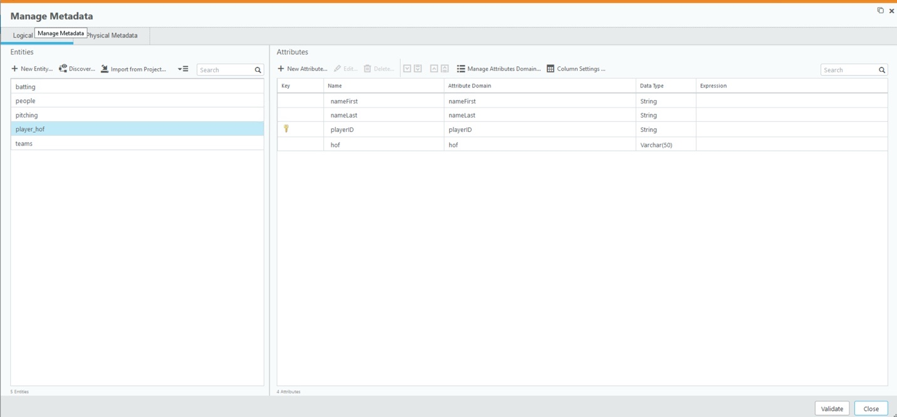
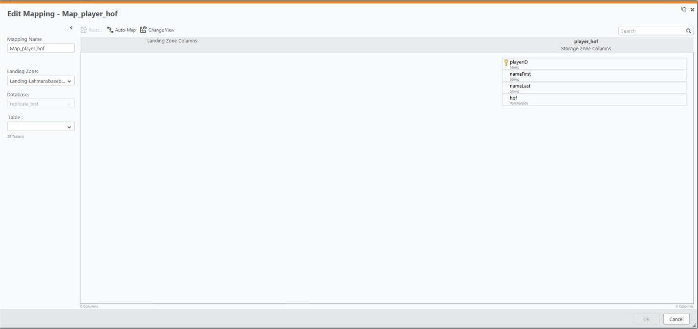

  

# **_Tutorial Qlik Compose and Azure Databricks with Delta_**

## **Partner Engineering**

 
 
 
 
John Park 
Principal Solution Architect 
john.park@qlik.com

**Version: 1.1** 
**Initial Release Date: 17-Feb-20**    

**Revisions**      | **Notes**   | **Date**  | **Version**
------------------ | ----------- | --------- | -----------
Initial Draft      | 03-Jan-2020 | John Park | 0.1         |
Additional Changes | 14-Feb-2020 | John Park | 0.2         |
Final Edit for V1  | 21-Feb-2020 | John Park | 0.4         |
Cosmetic Changes   | 21-Feb-2020 | John Park | 1.0         |
Edits for Markdown | 25-Feb-2020 | John Park | 1.1         |

# Table of Contents
-------------------
[**Summary**](#summary)
[**Section A - Verify Connections for Qlik Compose**](#section-a---verify-connections-for-qlik-compose)

[**Part 1 -- Starting Point for this Tutorial**](#part-1----starting-point-for-this-tutorial)

[**Section B - Move Data from Landing to Storage Using Compose**](#section-b---move-data-from-landing-to-storage-using-compose)

[**Part 1 - Add New Entity**](#part-1---add-new-entity)

[**Part 2 - Create Tasks for Compose**](#part-2---create-tasks-for-compose)

[**Part 3 - View Tasks from Monitor and Run Tasks**](#part-3---view-tasks-from-monitor-and-run-tasks)

[**Section C - Use Lookup and Created Curated Table for Data Lake**](#section-c---use-lookup-and-created-curated-table-for-data-lake)

[**Part 1 - Create a New Entity in Storage Zone**](#part-1---create-a-new-entity-in-storage-zone)

[**Section D - Verify Data Movement and Changes in Azure Databricks**](#section-d---verify-data-movement-and-changes-in-azure-databricks)

## **Summary**
-------------

This document was created to supplement Qlik Compose Documentation for
customers intending to Qlik Replicate and Azure Databricks. The Office
Documentation can be found at

- <https://help.qlik.com/en-US/replicate/Content/Replicate/Home.htm>.

This Tutorial should help Customers interested in a step by step by
directions to implement Qlik Compose for Data Lake to Automate Creating
a Managed Data Lake from Data Landed in Azure Databricks. This Tutorial
is continuation from

*Tutorial Qlik Replicate and Azure Databricks and Configuring Qlik
Compose with Azure Databricks. Please note this is a simple Tutorial of
Qlik Compose and we will not be delving into Details. *

**High Level Overview**

-   Verify Connections

-   Scenario 1 - Move Data from Landing to Storage using Compose

-   Scenario 2 - Use Lookup to Create a Player List with Hall Of Fame
    Inductees

-   Verify Data Movement and Changes in Qlik Compose

High Level Architecture

**Prerequisites for this this Tutorial are following:**

1.  Installed Qlik Compose Server version 6.5 or above

2.  Configured and verified Azure Databricks Account

# **Section A - Verify Connections for Qlik Compose**
----------------------------------------------------

### **Part 1 -- Starting Point for this Tutorial**

Qlik Compose should be installed properly and Landing Zone and Storage
Connection should be configured. Your Compose windows should look
similar to following.

***Figure A.1.0***

Pressing the "Connections" Button bring up Landing and Storage
connections.

**Verify each connection by Pressing "Test Connection" Button.**

***Figure A.1.1***

# **Section B - Move Data from Landing to Storage Using Compose**
----------------------------------------------------------------

The next phase after you've streamed data into Azure Databricks is to
consider how to operationalize the setup, ongoing care, and feeding of
your data lake. In a typical data lake , most of the initial deployment
time and effort is spent writing ETL (Extract-Transform-Load) code
curate data for use by third party tools and to run advanced analytics.
Qlik Compose is a automation platform managed data lakes. The role of
Compose is to automates the time-consuming tasks of building and
maintaining data lakes. It's metadata-driven approach generates the
necessary artifacts and ETL scripts to automatically manage your entire
data lake lifecycle. As a result, business analysts and data architects
experience substantial productivity gains that speed the time to
insight.

For example, Data engineering, ingesting(hydrating) wrangling of a
typical data lake consumes about 50% of the initial deployment effort.
However, because Compose generates the appropriate ETL code, that data
lake is managed.

The first use case scenario we will walk through is simple movement of
data from Landing Zone to Storage area with metadata changes and
curating of columns.

High Level Overview

-   We will move tables people, teams, batting, and pitching to Storage.

-   We will enhance the metadata for batting table and add more
    descriptors.

### **Part 1 - Add New Entity**

In Qlik Compose in the Storage tile Press "Metadata" Button

***Figure B.1.0***

You should see a full screen Manage Metadata window

***Figure B.1.1***

Press "Discover" Button

***Figure B.1.2***

Press the Search button to see all the tables from Landing Zone

***Figure B.1.3***

Move people, team, batting, and pitching to Selected Tables/View by
selecting one by one and using ">" button.

Hit "OK" button to Generate Metadata from Landing to Storage

***Figure B.1.4***

At this point you are going to get a screen that looks like this.

***Figure B.1.5***

We are going to use DataDictionary from Lahman's Baseball and Enhance
the Metadata and only pickup columns we deem necessary

Data Dictionary
<http://www.seanlahman.com/files/database/readme2019.txt>

For Batting Table Remove ID column and Enhance the Column Names

Step 1. Highlight "ID" and Press Delete button on Top.

Step 2. Double Click "playerID" and check Key

Step 3. Rename all Columns and Remove Unneeded Columns to Names from
above Dictionary

*ID, team_id, G_batting columns removed and " " replaced with _*

The final Output should look like the following

***Figure B.1.6**

Click "Validate" Button

***Figure B.1.7***

For people, teams and pitching we will leave those tables alone.

### **Part 2 - Create Tasks for Compose**

After the steps above you should have added 4 entities and on the **Data
Storage Tasks** you should see full and CDC task autogenerated**. Using
auto Discovery Qlik Compose Creates task to move data from Compose to
Storage area using Delta.**

***Figure B.2.0**

Click on Data Storage Tasks and you can see the 2 Tasks and Mapping for
those tasks.

***Figure B.2.1***

Double Click on batting mappings

***Figure B.2.2***

Verify the Metadata update are complete, and all columns are mapped.

Press OK to go back to "Managed Data Storage Tasks" area.(Figure A.0.11)

Press Close to go to Main Screen. (Figure A.0.10)

Press "Create" Button to Initiate the Table Creations. ***Tables must be
created before tasks/Mappings can be validated an activated***

***Figure B.2.3***

Press Close button when you see "The Storage Zone tables were created
successfully."

***Figure B.2.4***

In the Storage Zone Tile "Create" Button has now Turned into "Validate"
Button

***Figure B.2.5***

Press Validate to Validate Storage -- (Not Necessary but use to Sync
Storage with Mapping)

Press Button for "Data Storage Tasks" and Highlight all task and Press
"Generate Button"

***Figure B.2.6***

***Figure B.2.7***

Press Close and Generate for Task "Landing-Lahmansbaseball_CDC" (Select
from Tasks List)

In the menu "Run" button and "Task Commands" button should now be
selectable.

***Figure B.2.8**

At this point you can run these tasks from this screen for this Tutorial
Press Close

### **Part 3 - View Tasks from Monitor and Run Tasks**

At this point we have created 2 tasks, one for Full and One for CDC into
Databricks Delta where 4 tables (team, batting, people, pitching) are
able to be moved to Managed Data Lake on Azure Databricks.

4 table are referred to as 4 Entities

2 Tasks are shown and Task each have set of instructions.(Please refer
to Official Documentation for more detail)

This is what your Screen should look like

***Figure B.3.0***

Press "Monitor" Icon in top right Corner

***Figure B.3.1**

Note: Since my Qlik Replicate Server is Connected Qlik Compose Server I
can see my CDC process to Land the data into Landing Zone located.

Highlight "Landing-Lahmansbaseball" Task(Full) load and press "Run"

***Figure B.3.2***

This should be your output

***Figure B.3.3***

***Figure B.3.4***

At this point you have created a Qlik Compose Storage area with 2 Tasks
that moved data from a **Landing Zone to Storage area. **

**Please refer to Documentation about Scheduling, Notification and
Workflows.**

# **Section C - Use Lookup and Created Curated Table for Data Lake**
-------------------------------------------------------------------

In this scenario you will create a new Entity in Qlik Compose where you
will generate a list of people and teams and lookup in hall of fame
table to place a marker if player was inducted to hall of fame. This
scenario is similar to using Compose to generate curated data set for
managed data lake.

### **Part 1 - Create a New Entity in Storage Zone**

Click the "Metadata" Button in Storage Zone

Click "+New Entity" button

***Figure C.1.0***

Add New Entity and use a name like "player_hof"

***Figure C.1.1***

Click on "player_hof" and using the "+New Attribute" add the needed
attributes.

1.  "namefirst", "nameLast" and "playerID" can be added with lookup with
    Attribute Domain

    ***Figure C.1.2***

    
2.  Using the "+" button define new attributes "hof"

    ***Figure C.1.3***

    

3.  Double Click on "playerID" and check the "Key" checkbox.

4.  Press "Validate" button and everything should validate.

This is what your "Manage Metadata" screen should look like

***Figure C.1.4***

Go to Main Screen and Validate Storage Zone

Press Validate and Let Qlik Compose adjust Storage. Press "Adjust
Automatically"

***Figure C.1.5***

***Figure C.1.6***

Press Data Storage Tasks

***Figure C.1.7***

See that "player_hof" table is available without mapping.

Add New Task by Pressing "+ New Task"

Name Task something unique.

Create a new Task with no Change Processing since this is a Full Load
and no history needs to be kept.

***Figure C.1.8***

In the Mapping Area press "+ New Mapping"

***Figure C.1.9***

Edit Mapping Screen will appear.

***Figure C.1.10***

Bring in people Table and press "Auto-Map" playerID, namefirst, and
namelast will auto map.

***Figure C.1.11***

Press the Lookup Icon for 'hof'

***Figure C.1.12***

For hof use "halloffame" table as lookup and place "inducted" attribute
hof

***Figure C.1.13***

Lookup Transformation should look like the following

***Figure C.1.14***

Go to main screen and Validate Storage Zone again. This time Storage
zone will be different than Metadata. Generate Adjust Script.

***Figure C.1.15***
  

***Figure C.1.16***

Copy Adjust Script and execute in Azure Databricks Notes with needed
adjustments.

Click Validate and Resync

***Figure C.1.17***

Go Into "Manage Data Storage Tasks" and Generate for "Load-Hall-Of-Fame" Task

***Figure C.1.18***

Go to Monitor and Execute "Load-Hall-Of-Fame" Task 

***Figure C.1.19***

At this point you have moved 5 Entities or DataSets into Managed Data
Lake.

# **Section D - Verify Data Movement and Changes in Azure Databricks**
--------------------------------------------------------------------

By accessing Azure Databricks Portal you should validated following

-   Creation of Database 'compose_test'

-   Creating of Table team, batting, people and pitching

-   Creation of Enhanced Metadata / Column Names for batting table

-   Creation player_hof table and column hof populated properly

***Figure D.0.1***  

***Figure D.0.2***

***Figure D.0.3***

