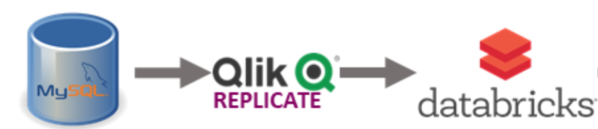
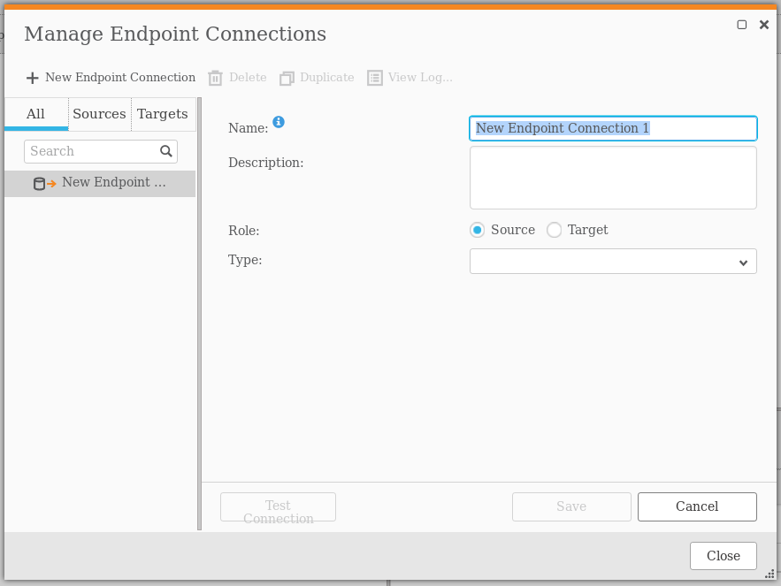
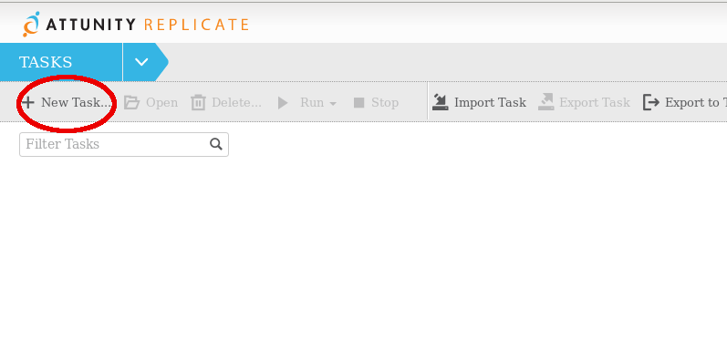
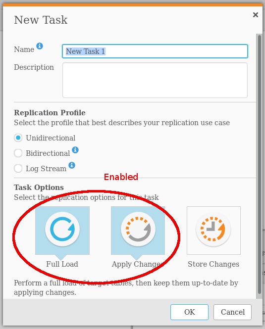

{width="3.2083333333333335in"
height="0.9791666666666666in"}

Tutorial -- Qlik Replicate and Azure Databricks

Partner Engineering

**Version: 1.0**

**Initial Release Date: 17-Feb-20**

{width="2.9166666666666665in"
height="1.875in"}

  **Revisions**                                                         **Notes**       **DATE**
  --------------------------------------------------------------------- --------------- ----------
  John Park/Author/ Principal Solution Architect, Partner Engineering   Initial Draft   18-Feb

  {#section .TOCHeading}
=

Table of Contents {#table-of-contents .TOCHeading}
=================

[Summary 4](#summary)

[Section A -- Configure/Verify MySQL Database
5](#section-a-configureverify-mysql-database)

[**Part 1 -- Verify MySQL Database** 5](#part-1-verify-mysql-database)

[**Part 2-- Create Sample Schema and Load Data**
5](#part-2-create-sample-schema-and-load-data)

[**Part 3 -- Create and Configure Qlik Replicate Connection for MySQL
DB**
7](#part-3-create-and-configure-qlik-replicate-connection-for-mysql-db)

[Section B -- Configure/Verify Azure Databricks
10](#section-b-configureverify-azure-databricks)

[**Part 1 -- Verify Azure Databricks**
10](#part-1-verify-azure-databricks)

[**Part 2-- Create/Verify Azure ADLS 2 and Databricks Connection**
10](#part-2-createverify-azure-adls-2-and-databricks-connection)

[Section C -- Create Qlik Replicate CDC Job from MySQL to Azure
Databricks
12](#section-c-create-qlik-replicate-cdc-job-from-mysql-to-azure-databricks)

[**Part 1 -- Create Qlik Replicate CDC Job**
12](#part-1-create-qlik-replicate-cdc-job)

[**Part 2-- Test Initial Load and Verify Data Movements to Azure
Databricks**
17](#part-2-test-initial-load-and-verify-data-movements-to-azure-databricks)

[**Part 3 -- Test Changes and Verify Delta Movements to Azure
Databricks**
18](#part-3-test-changes-and-verify-delta-movements-to-azure-databricks)

 **Summary **
-------------

This document was created to supplement Qlik Replicate Documentation for
customers intending to Qlik Replicate and Azure Databricks. The Office
Documentation can be found at
<https://help.qlik.com/en-US/replicate/Content/Replicate/Home.htm>.

This Tutorial should help Customers interested in a step by step by
directions to implement Qlik Replicate CDC process from RDBMS to Azure
Databricks.

High Level Overview

-   Create Connection to MySQL Database

-   Create Connection to Azure Databricks

-   Create Qlik Replicate CDC Job

-   Verify Data Movement and Changes

High Level Architecture

{width="5.807228783902012in"
height="1.2666666666666666in"}

Prerequisites for this this Tutorial are following:

1.  Working Azure Account with ability to access to resources

2.  Installed Qlik Replicate Server version 6.5 or above

3.  Configured and verified MySQL Database

4.  Configured and verified Azure Databricks Account

5.  Connectivity between MySQL Database, Qlik Replicate Server and Azure
    Databricks instances.

**Section A -- Configure/Verify MySQL Database**
------------------------------------------------

### **Part 1 -- Verify MySQL Database**

For this tutorial We have setup a MySQL 8.0.19 CE Database Sample
Database

*Note: For this Tutorial to work MySQL must **enable binary logging**
and use **mysql\_native\_password** for authentication.*

Verify Database Connectivity Using MySQL Workbench.

***Figure A.2***

{width="3.8192771216097987in"
height="2.4115310586176726in"}

### **Part 2-- Create Sample Schema and Load Data**

The Data we will use will be from Baseball Data from
<http://www.seanlahman.com/baseball-archive/statistics/>

Download the MySQL Version of Data and Execute

Note the Baseball Data Version we are using is 2019 data and it must be
loaded to MySQL Version 8.0

***Figure A.2***

{width="4.379517716535433in"
height="2.419963910761155in"}

Once the Import has finished you should be able inspect the database and
see tables, and results from sample query.

***Figure A.3***

{width="4.33965113735783in"
height="2.6204811898512688in"}

*Sample Query --*

*use lahmansbaseballdb;*

*select \* from people;*

### **Part 3 -- Create and Configure Qlik Replicate Connection for MySQL DB**

Now we will create Qlik Replicate connections for Source and verify the
connection. Qlik Replicate should be installed and functional.

*For this document we are using Attunity Replicate Version 6.5.0.354. *

After login on the first thing we need to do is create a source
endpoint. We do this by clicking the Manage Endpoint Connections button
at the top of the screen.

***Figure A.4***

{width="4.721729002624672in"
height="1.85542104111986in"}

Following Prompt will appear.

***Figure A.5***

{width="3.6807228783902013in"
height="2.74913823272091in"}

From there, click on "*Add New Endpoint Connection"* link or the + New
Endpoint Connection button at the top of the screen.

Once you do that you will see this window:

***Figure A.6***

{width="3.584255249343832in"
height="2.6912554680664917in"}

We will now create a MySQL source endpoint:

-   Replace the text **New Endpoint Connection 1** with something more
    descriptive like MySQL -Source Local,

-   Verify Source radio button is selected,

-   Select "MySQL" from the dropdown selection box

Fill in the blanks as indicated in the images above:

-   Server: \[your\_servername\]

-   Port: 3306

-   Username: \[your\_username\]

-   Password: \[your\_password\]

-   Security/SSL Mode: Required\*(Use Down Arrow to View Menu)

***Figure A.7***

{width="3.704819553805774in"
height="2.8601531058617673in"}

Click on Test Connection. Your screen should look like the following,
indicating that your connection succeeded.

Assuming so, click Save and the configuration of your MySQL source
endpoint is complete. Click Close to close the window.

For more details about using MySQL as a source, please review the
appropriate section in the User Guide [Using a MySQL-Based Database as a
Source](https://tdxxuxjzmt-vm.testdrive.attunity.com/files/AttunityReplicate_User_Guide.pdf#%5B%7B%22num%22%3A4258%2C%22gen%22%3A0%7D%2C%7B%22name%22%3A%22XYZ%22%7D%2C79.5%2C741%2C0%5D)

**Section B -- Configure/Verify Azure Databricks **
---------------------------------------------------

### **Part 1 -- Verify Azure Databricks**

First, we need to set up the Azure storage account that Qlik Replicate
will use to map data into Databricks. We will setup Azure Data Lake
Storage (ADLSv2) to manage the external tables.

Please refer to "Configuring Azure ADLSvs2" for Detail instructions.

### **Part 2-- Create/Verify Azure ADLS 2 and Databricks Connection**

Note Azure Databricks Cluster should be live and Azure ADLSv2 setting
should be configured property.

Following Information should be gathered

**Azure Storage:**

-   Storage Account Name: \_\_\_\_\_\_\_\_\_\_\_ (Azure Portal --\>
    Storage Account)

-   Azure Active Directory ID: \_\_\_\_\_\_\_\_\_\_\_ (Azure Portal --\>
    Azure Active Directory --\> App Registration)

-   Azure Active Directory application ID: \_\_\_\_\_\_\_\_\_\_\_ (Azure
    Portal --\> Azure Active Directory -- App Registration)

-   Azure Active Directory application key: \_\_\_\_\_\_\_\_\_\_\_
    (Azure Portal --\> Azure Active Directory --\> App Registration --\>
    Certificates and Secret)

-   File System: \_\_\_\_\_\_\_\_\_\_\_ (Azure Portal --\> Storage
    Account -\> Containers)

-   Target folder: \_\_\_\_\_\_\_\_\_\_\_ (Azure Portal --\> Storage
    Account -\> Containers)

***Figure B.1***

{width="3.801205161854768in"
height="2.0325885826771652in"}

**Databricks ODBC Access:**

-   Host: \_\_\_\_\_\_\_\_\_\_\_ (Azure Databricks Portal --\> Clusters
    -\> Advanced Options -\> JDBC/ODBC)

-   Port: \_\_\_\_\_\_\_\_\_\_\_ (Azure Databricks Portal --\> Clusters
    -\> Advanced Options -\> JDBC/ODBC)

-   Token: \_\_\_\_\_\_\_\_\_\_\_ (Azure Databricks Portal --\> User
    Settings -\> Access Tokens -\> Generate New Token)

-   HTTP Path: \_\_\_\_\_\_\_\_\_\_\_ (Azure Databricks Portal --\>
    Clusters -\> Advanced Options -\> JDBC/ODBC

-   Database: \_\_\_\_\_\_\_\_\_\_\_ (Azure Databricks Portal --\> Data)

-   Mount Path: \_\_\_\_\_\_\_\_\_\_\_ (Azure Databricks Portal -
    Notebook)

***Figure B.2***

{width="4.228472222222222in"
height="2.2587992125984253in"}

Click on Test Connection. Your screen should look like the following,
indicating that your connection succeeded.

***Figure B.3 ***

{width="4.228915135608049in"
height="2.580722878390201in"}

**\
**

**Section C -- Create Qlik Replicate CDC Job from MySQL to Azure Databricks**
-----------------------------------------------------------------------------

### **Part 1 -- Create Qlik Replicate CDC Job**

Now that we have configured our MySQL source and Azure Databricks target
endpoints, we need to tie them together in what we call a Replicate
**task**. In short, a task defines the following:

-   A source endpoint

-   A target endpoint

-   The list of tables that we want to capture

-   Any transformations we want to make on the data

To get started, we need to create a task. Click on the + New Task button
at the top of the screen.

***Figure C.1***

{width="3.925051399825022in"
height="0.8975907699037621in"}

Once you do, a window like this will pop up:

***Figure C.2***

{width="2.397590769903762in"
height="3.034096675415573in"}

Give this task a meaningful name like MySQL-to-Azure Databricks. For
this task we will take the defaults:

-   Name: MySQL-to-Azure Databricks

-   Unidirectional

-   Full Load: enabled (Blue highlight is enabled; click to enable /
    disable.)

-   Apply Changes: enabled (Blue highlight is enabled; click to enable /
    disable.)

-   Store Changes: disabled (Blue highlight is enabled; click to enable
    / disable.)

***Figure C.3***

{width="2.1496959755030622in"
height="2.650602580927384in"}

Once you have everything set, press OK to create the task. When you have
completed this step, you will see a window that looks like this:

***Figure C.4***

{width="4.180722878390201in"
height="2.056862423447069in"}

Attunity is all about ease of use. The interface is point-and-click,
drag-and-drop. To configure our task, we need to select a source
endpoint (MySQL) and a target endpoint (Azure Databricks). You can
either drag the MySQL Source endpoint from the box on the left of the
screen and drop it into the circle that says Drop source endpoint here,
or you can click on the arrow that appears just to the right of the
endpoint when you highlight it.

Repeat the same process for the Azure Databricks Target endpoint. Your
screen should now look like this:

When you have finished dropping the Source Endpoints it should look like
the following:

***Figure C.5***

{width="4.130218722659667in"
height="1.9552351268591426in"}

Our next step is to select the tables we want to replicate from MySQL
into Azure Databricks. Click on the *Table Selection\...* button in the
top center of your browser.

***Figure C.6***

{width="6.5in"
height="0.8409722222222222in"}

and from there select the ***lahmansbaseballdb*** schema.

{width="3.42253280839895in"
height="2.271084864391951in"}

Press the ***Search*** button. This will retrieve a list of all the
tables in the *lahmanbasebald* schema. Note: entering % is not strictly
required. By default, Attunity Replicate will search for all tables (%)
if you do not limit the search.

***Figure C.7***

{width="3.27619750656168in"
height="2.14457895888014in"}

and then press the \>\> button to move all of the tables from the
Results list into the Selected Tables list. Note that we also had the
option of simply wildcarding all tables, or selectively choosing tables
from the Results list.

***Figure C.8***

{width="3.0120483377077867in"
height="1.9996675415573053in"}

Click "OK" and you job is ready to execute.

Click "Save" Icon

***Figure C.9***

{width="3.957831364829396in"
height="1.8855358705161855in"}

Press "Run" Icon.

***Figure C.10***

{width="4.0in"
height="1.9004516622922134in"}

### **Part 2-- Test Initial Load and Verify Data Movements to Azure Databricks**

At this step you should be able to execute the Task from Replicate and
verify the Data from Azure Databricks window.

Below is a what you should see on Qlik Replicate Task Manager

***Figure C.11***

{width="3.6224332895888014in"
height="1.7891568241469815in"}

Below is what you see on Azure Databricks Database by Clicking Data
button and Clicking on Tables.

***Figure C.12***

{width="1.6396073928258967in"
height="2.301205161854768in"}

***Figure C.13***

{width="3.716867891513561in"
height="1.7615409011373577in"}

### **Part 3 -- Test Changes and Verify Delta Movements to Azure Databricks**

Make Changes to your MySQL Database and see changes flow through to
Azure Databricks Database.

Alter Player Table by Adding new Player

***INSERT INTO \`lahmansbaseballdb\`.\`people\` (\`playerID\`,
\`birthYear\`, \`birthMonth\`, \`birthDay\`, \`birthCountry\`,
\`birthState\`, \`birthCity\`, \`deathYear\`, \`deathMonth\`,
\`deathDay\`, \`deathCountry\`, \`deathState\`, \`deathCity\`,
\`nameFirst\`, \`nameLast\`, \`nameGiven\`, \`weight\`, \`height\`,
\`bats\`, \`throws\`, \`debut\`, \`finalGame\`, \`retroID\`,
\`bbrefID\`, \`birth\_date\`, \`debut\_date\`, \`finalgame\_date\`,
\`death\_date\`) VALUES (\'parkjo01\', \'1980\', \'3\', \'2\', \'USA\',
\'GA\', \'Lilburn\', \'2043\', \'03\', \'2\', \'USA\', \'FL\',
\'Ocala\', \'John\', \'Park\', \'John Park\', \'205\', \'73\', \'R\',
\'R\', \'1995-09-10\', \'1987-09-27\', \'parkj101\', \'parkjo01\',
\'1980-03-02\', \'1987-09-10\', \'1995-09-27\', \'2043-11-15\')***

Verify the Changes in Attunity Task Monitor 1 row has been updated.

***Figure C.14***

{width="6.5in"
height="3.217361111111111in"}

Verify the Changes in Azure Databricks.

***Figure C.15***

{width="6.5in"
height="1.0326388888888889in"}
